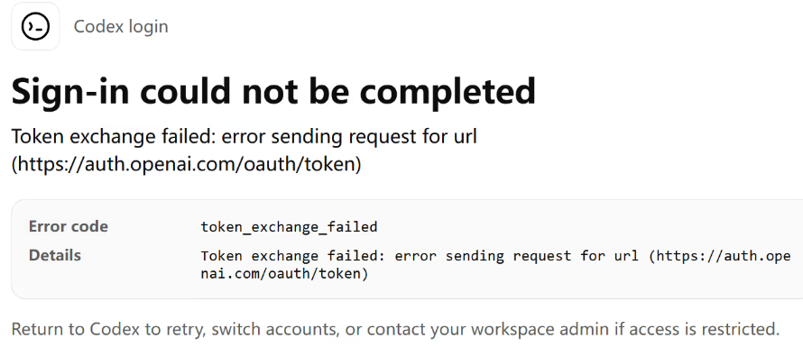

本文主要针对WSL2中Codex登录时出现的“token_exchange_failed”错误，默认已完成vscode+WSL2配置和Windows端的Codex登录。

## 一、WSL 的网络代理

### 1. 确认 Windows 代理端口

以clash为例，打开'设置'-'基础配置'，查看HTTP代理端口如`7890`。

### 2. 动态取得 Windows 宿主机地址

NAT 网络下，从默认路由动态获取WSL2宿主机地址：

```bash
ip route show default | awk '{print $3; exit}'
```

因为 WSL 重启后地址可能改变，故不使用固定地址。

### 3. 配置代理

打开 ~/.bashrc 文件：

```bash
nano ~/.bashrc
```

在文件末尾粘贴：

```bash
HOST_IP=$(ip route | awk '/^default/ {print $3}')
PROXY_PORT=7890 #自行根据端口修改

export http_proxy=http://$HOST_IP:$PROXY_PORT
export https_proxy=http://$HOST_IP:$PROXY_PORT

proxyon()  { export http_proxy="http://$HOST_IP:$PROXY_PORT"; export https_proxy="$http_proxy"; echo "[proxy] ON -> $http_proxy"; }
proxyoff() { unset http_proxy https_proxy HTTP_PROXY HTTPS_PROXY; echo "[proxy] OFF"; }
```

## 二、安装 Codex CLI

### 直接安装

Codex最新教程支持直接安装

```bash
curl -fsSL https://chatgpt.com/codex/install.sh | sh
codex --version
```

```bash
command -v codex
echo "$PATH"
```

### 使用 npm

通常使用 Node.js/npm：

```bash
npm install -g @openai/codex
codex --version
```

遇到 `EACCES` 时使用 nvm 管理 Node.js，或把 npm 的全局目录放到当前用户下：

```bash
mkdir -p "$HOME/.npm-global"
npm config set prefix "$HOME/.npm-global"
export PATH="$HOME/.npm-global/bin:$PATH"
```

## 三、完成 Codex 登录

标准流程：

```bash
codex login
```

选择 **Sign in with ChatGPT**可能会报错token_exchange_failed



### 复用 Windows 的auth.json

先在 Windows 中完成 Codex 登录，再将认证文件复制到 WSL：

```bash
mkdir -p ~/.codex
install -m 600 \
  /mnt/c/Users/<Windows用户名>/.codex/auth.json \
  ~/.codex/auth.json
```

完成后检查登录状态：

```bash
codex login status
```

### 设备码登录

如果浏览器回调不成功，也可以使用设备码：

```bash
codex login --device-auth
```

终端会给出一个网址和一次性代码。在 Windows 浏览器中打开网址，登录并输入代码即可。需要账号或工作区允许设备码登录。
